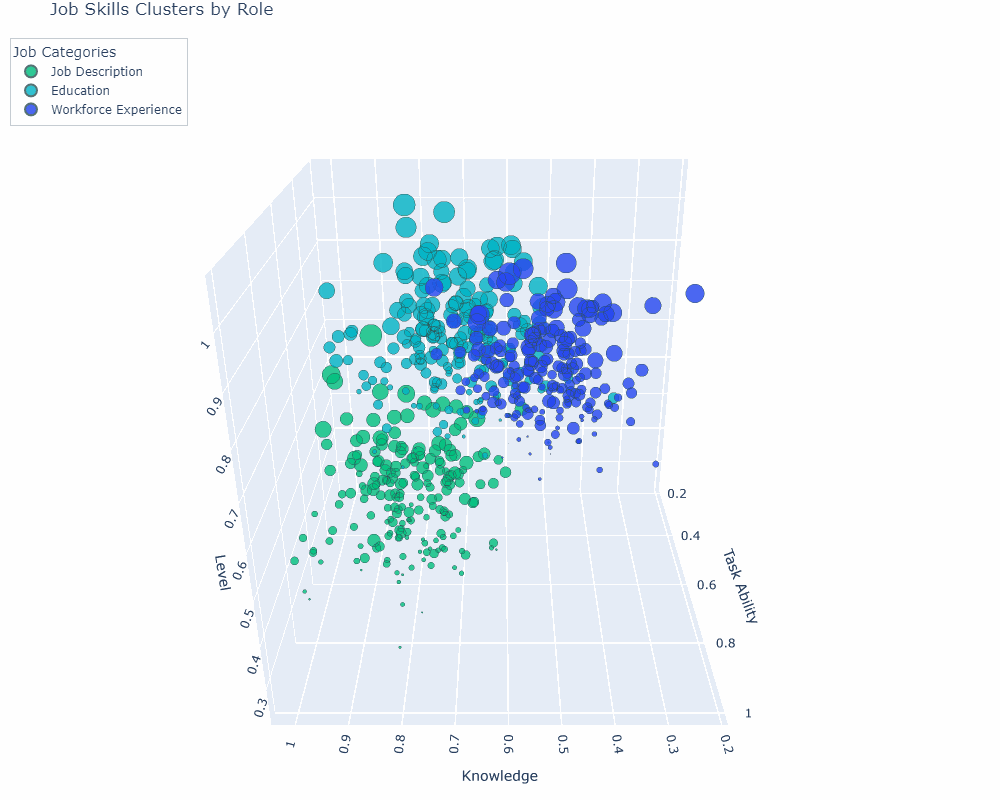

## 🫏 This repo contains code and output for creating interactive 3D Scatter Plot in Python using Plotly 

### ⚡ Feel free to check out the interactive output of this [here](https://phanindra-max.github.io/plotly-visualization/) ⚡

- GIF of the visualization generated from the code:

PS: This project uses random data points to create this visualization.

